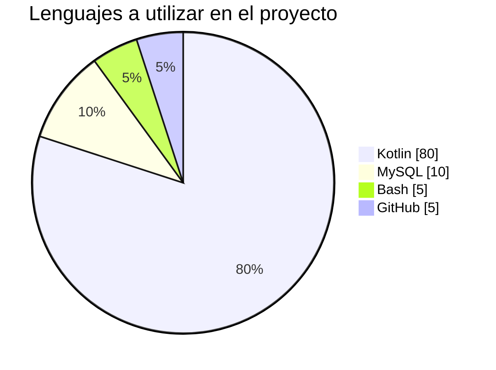
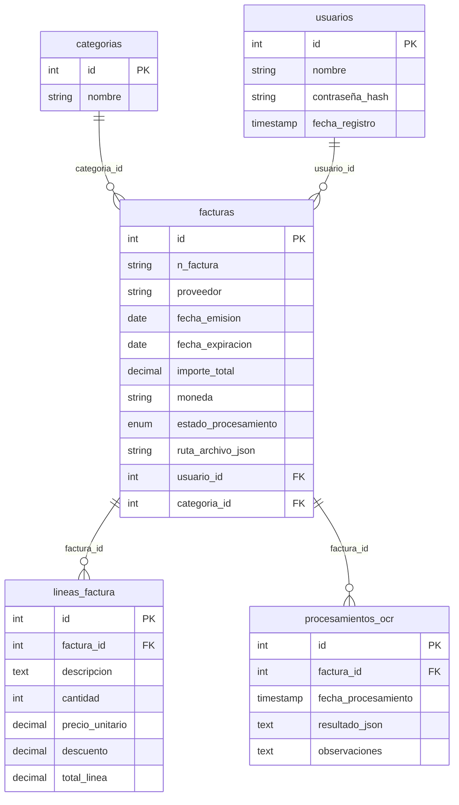

***

# CoachHub

ScanFlow es una aplicación de Android la cual trata de hacerle la vida más facil a los usuarios que tengan que llevar una gestión de la contabilidad, permitiendoles subir facturas digitalmente o mediante una foto y que estas sean procesadas sin necesidad de que el usuario escriba los datos manualmente.

## Características principales:

- Recopilación de datos eficaz y sencilla.
- Subida de información automática
- Gestión e historial.

## Tecnologías usadas (en principio)

   
 

(MySQL o el gestor de base de datos correspondiente que acabe usando)

## Base de datos (en principio)

## Estado del proyecto 📝

Casi terminado ⌛

## Contacto 💬 

|Correo Electrónico|Número de teléfono|
|------------------|------------------|
|docejavii@gmail.com|+34 640 12 78 42|

## Autor

<a href="https://github.com/javiidoce"> Javier Melendo </a>

## Licencia ⚡

Copyright 2025 Javier Melendo Soler 

Por la presente se concede permiso, libre de cargos, a cualquier persona que obtenga una copia de este software y de los archivos de documentación asociados a utilizar CoachHub sin restricción, incluyendo sin limitación los derechos a usar, copiar, modificar, fusionar, publicar, distribuir, sublicenciar, y/o vender copias de CoachHub, y a permitir a las personas a las que se les proporcione el programa a hacer lo mismo, sujeto a las siguientes condiciones:  El aviso de copyright anterior y este aviso de permiso se incluirán en todas las copias o partes sustanciales del Software.  

EL SOFTWARE SE PROPORCIONA "COMO ESTÁ", SIN GARANTÍA DE NINGÚN TIPO, EXPRESA O IMPLÍCITA, INCLUYENDO PERO NO LIMITADO A GARANTÍAS DE COMERCIALIZACIÓN, IDONEIDAD PARA UN PROPÓSITO PARTICULAR E INCUMPLIMIENTO. EN NINGÚN CASO LOS AUTORES O PROPIETARIOS DE LOS DERECHOS DE AUTOR SERÁN RESPONSABLES DE NINGUNA RECLAMACIÓN, DAÑOS U OTRAS RESPONSABILIDADES, YA SEA EN UNA ACCIÓN DE CONTRATO, AGRAVIO O CUALQUIER OTRO MOTIVO, DERIVADAS DE, FUERA DE O EN CONEXIÓN CON EL SOFTWARE O SU USO U OTRO TIPO DE ACCIONES EN EL SOFTWARE.

